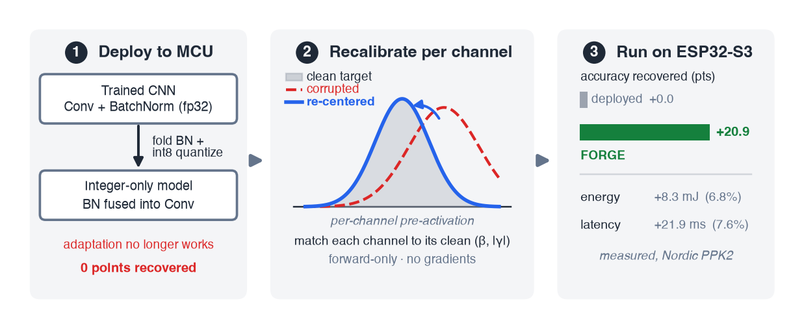

# FORGE: Forward-Only Test-Time Adaptation for Integer-Only Vision Models on Microcontrollers

<p align="center">
  
</p>

Code, trained checkpoints, and measured results for the TMLR paper.

> **FORGE: Forward-Only Test-Time Adaptation for Integer-Only Vision Models on Microcontrollers**
> Muhammad Rehan, Haider Ali, Muhammad Ali Munir, Moaz Amjad
> *Transactions on Machine Learning Research*, 2026.
> [OpenReview](https://openreview.net/forum?id=A45I5p25dd) · [PDF](paper/forge-tmlr-2026.pdf)

## What this is

Deploying a CNN to a microcontroller **folds batch normalization into the preceding
convolutions** and quantizes to int8. Folding is mandatory for efficient integer
inference — and it deletes the running statistics that every forward-only test-time
adaptation method recalibrates. The deployed model degrades under distribution shift
exactly as much as its float counterpart, but none of the usual remedies apply to it.
We call this the **adaptation gap**.

FORGE closes it. At each folded convolution, it re-normalizes the per-channel output
back to the clean training statistics `(β, |γ|)` that the original BN guaranteed,
estimated online from forward passes alone — no gradients, no autograd graph, no
optimizer state. On CIFAR-10-C it recovers **+20.9** accuracy points (gradient-based
TENT gets +24.9), and on an ESP32-S3 it costs a measured **8.3 mJ (6.8% of inference
energy)** and **21.9 ms** per adaptation.

The core of the method is ~30 lines: [`src/fold.py`](src/fold.py), class `ChannelRecalib`.

**Scope note.** FORGE is mixed-precision by design: the convolutions are genuine int8
(integer MACs, integer ESP-NN requantization, validated bit-exact on the device), and
the recalibration is a lightweight fp32 step around them, running on the MCU's FPU.

## Setup

```bash
python3 -m venv .venv && source .venv/bin/activate
pip install -r requirements.txt
```

Experiments were run on an Apple M4 (MPS); CUDA and CPU also work. Every script is
run **from the repository root** — paths (`data/`, `checkpoints/`, `results/`) are
resolved relative to the working directory.

### Data

CIFAR-10 and CIFAR-100 download automatically. The corruption benchmarks do not:

```bash
mkdir -p data
# CIFAR-10-C (~2.9 GB)
curl -L -o data/CIFAR-10-C.tar https://zenodo.org/records/2535967/files/CIFAR-10-C.tar
tar xf data/CIFAR-10-C.tar -C data/          # -> data/CIFAR-10-C/<corruption>.npy
# CIFAR-100-C (~2.9 GB)
curl -L -o data/CIFAR-100-C.tar https://zenodo.org/records/3555552/files/CIFAR-100-C.tar
tar xf data/CIFAR-100-C.tar -C data/
```

Tiny-ImageNet-200 comes from `http://cs231n.stanford.edu/tiny-imagenet-200.zip`
(unzip into `data/`). Its corrupted variant is **generated locally** by
[`src/data_tin.py`](src/data_tin.py) using the `imagecorruptions` package, rather than
downloaded — see the module docstring.

### Checkpoints

The four trained source models are included in [`checkpoints/`](checkpoints), so the
tables reproduce without retraining. To retrain:

```bash
python src/train.py --epochs 80                              # ResNet-20 / CIFAR-10
python src/train.py --dataset cifar100 --epochs 80
python src/train.py --arch mobilenetv2 --dataset tinyimagenet --epochs 80
```

## Reproducing the paper

Every number in the paper is in [`results/`](results) as JSON, so figures and tables
can be regenerated without rerunning the experiments. Each command below overwrites
the corresponding file.

| Exhibit | Content | Command | Result file |
|---|---|---|---|
| Fig. 2 | The adaptation gap (BN-preserved vs. folded) | `python src/run_phase1_quant.py`, `python src/run_phase1_fold.py` | `phase1_quant.json`, `phase1_fold.json` |
| Fig. 3 | Per-channel activation distributions | `python deploy/dump_activations.py` | `paper/activations.npz` |
| Tab. 2 | Baselines: source / scale-adapt / BN-adapt / TENT / FORGE | `python src/run_baselines.py`, `python src/run_phase1_method.py` | `baselines_cifar10.json`, `phase1_method.json` |
| Tab. 3 | Per-corruption breakdown | `python src/run_baselines.py` | `baselines_cifar10.json` |
| Fig. 4 | Selective-layer recalibration (held-out vs. oracle) | `python src/run_phase2_heldout.py` | `phase2_heldout.json` |
| Fig. 5 | Batch-size curve, fixed vs. window-matched momentum | `python src/run_phase2_bscurve.py` | `phase2_bscurve.json` |
| Tab. 4 | Generalization: 2 architectures × 3 datasets | `python src/run_generalize.py --arch <a> --dataset <d>` | `generalize_*.json` |
| Tab. 5–6 | Ablations: momentum, bit-width | `python src/run_ablations.py` | `ablations.json` |
| Tab. 7 | When-to-adapt safety gate, all three benchmarks | `python src/run_gate_general.py --arch <a> --dataset <d>` | `gate_*.json` |
| Tab. 8 | On-device energy and latency | ESP32-S3 + PPK2, see below | (from the capture) |
| Tab. 9 | Law-of-total-variance decomposition | `python deploy/variance_decomp.py` | (printed) |
| — | Multi-seed error bars | `python src/run_multiseed.py` | `multiseed_*.json` |
| — | CoTTA in its native continual protocol | `python src/run_cotta_continual.py` | (printed) |

Figures are regenerated from the result JSONs with:

```bash
python paper/make_figures.py       # -> paper/fig_*.pdf
```

The `run_phase*.py` names are historical (they follow the project's development
phases); the table above is the authoritative mapping to the published exhibits.

## On-device deployment (ESP32-S3)

### Host side

```bash
python deploy/export_model.py                 # -> deploy/artifacts/{resnet20_int8.npz,model_data.h}
python deploy/validate_reference.py --n 500   # integer engine vs. PyTorch — must agree
python deploy/export_test_image.py --espnn    # -> deploy/esp32s3/main/test_image.h + golden logits
```

[`deploy/int8_reference.py`](deploy/int8_reference.py) is a self-contained NumPy
integer engine (int8 MACs, int32 accumulation, integer requantization) that serves as
the golden reference for the firmware. `validate_reference.py` checks it against the
PyTorch path before anything is flashed.

The generated `model_data.h` and `test_image.h` are **not committed** (they are large
and fully reproducible); run the two export scripts before building the firmware.

### Device side

Requires **ESP-IDF v5.x** and an ESP32-S3 board. The SIMD int8 kernels come from
Espressif's [esp-nn](https://github.com/espressif/esp-nn) (pinned at `d45b843`),
which is not vendored here:

```bash
cd deploy/esp32s3
git clone https://github.com/espressif/esp-nn.git components/esp-nn
git -C components/esp-nn checkout d45b843
idf.py set-target esp32s3
idf.py build flash monitor
```

Opening `app_main.c` in a host editor shows unresolved-include and undeclared-identifier
errors (`freertos/FreeRTOS.h`, the `m_*` weight symbols). These are expected: the ESP-IDF
headers come from the toolchain and the `m_*` symbols from the generated `model_data.h`.
Both resolve at `idf.py build`.

**The golden check gates every number.** On boot the firmware runs one inference with
adaptation off and compares against the exported `golden_logits`; it must print
`GOLDEN CHECK: ... [PASS]`. Latency, energy, and accuracy figures are meaningful only
after that passes.

### Energy measurement

Energy was measured with a **Nordic Power Profiler Kit II** in series with the 3V3
supply. The firmware raises `INFER_TRIGGER_GPIO` (pin 5) around each inference and
`PWR_TRIGGER_GPIO` (pin 4) around only the recalibration updates, so the profiler
integrates the two separately:

```bash
python deploy/ppk2_capture.py           # trigger-based capture
python deploy/ppk2_capture_notrig.py    # free-running capture, window separation in software
```

## Repository layout

```
src/fold.py             BN folding + ChannelRecalib — the method
src/tta_quant.py        forward-only adaptation levers (scale-adapt, channel-recalib)
src/quant.py            int8 fake-quantization and calibration
src/models.py           ResNet-20, MobileNetV2
src/baselines.py        BN-adapt, TENT, CoTTA
src/data.py             CIFAR-10/100 + their -C corruption sets
src/data_tin.py         Tiny-ImageNet-200 + locally generated Tiny-ImageNet-C
src/train.py            source-model training
src/run_*.py            one runner per paper exhibit (see the table above)

deploy/export_model.py      PyTorch -> int8 weights, scales, recalib targets
deploy/int8_reference.py    NumPy integer-only engine (golden reference)
deploy/validate_reference.py    integer engine vs. PyTorch
deploy/variance_decomp.py   law-of-total-variance decomposition (Tab. 9)
deploy/ppk2_capture*.py     Nordic PPK2 energy capture
deploy/esp32s3/             ESP-IDF firmware (esp-nn SIMD int8 kernels)

checkpoints/            trained source models
results/                measured results behind every table and figure
paper/                  published PDF, figures, and the figure-generation script
```

## Citation

```bibtex
@article{rehan2026forge,
  title   = {{FORGE}: Forward-Only Test-Time Adaptation for Integer-Only Vision
             Models on Microcontrollers},
  author  = {Rehan, Muhammad and Ali, Haider and Munir, Muhammad Ali and Amjad, Moaz},
  journal = {Transactions on Machine Learning Research},
  year    = {2026},
  url     = {https://openreview.net/forum?id=A45I5p25dd}
}
```

## License

[MIT](LICENSE).
